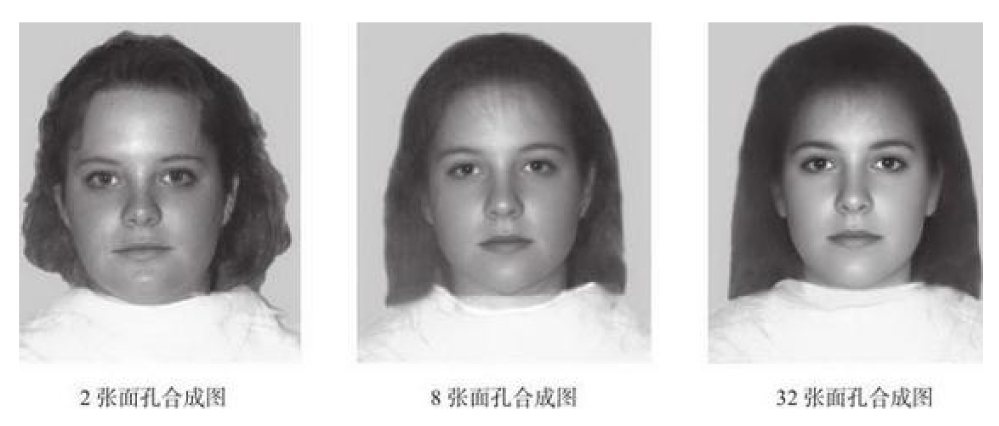
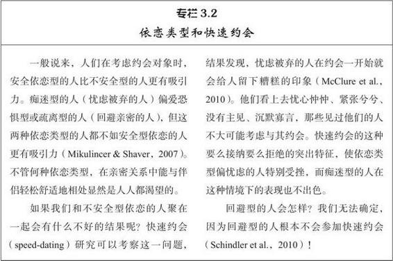
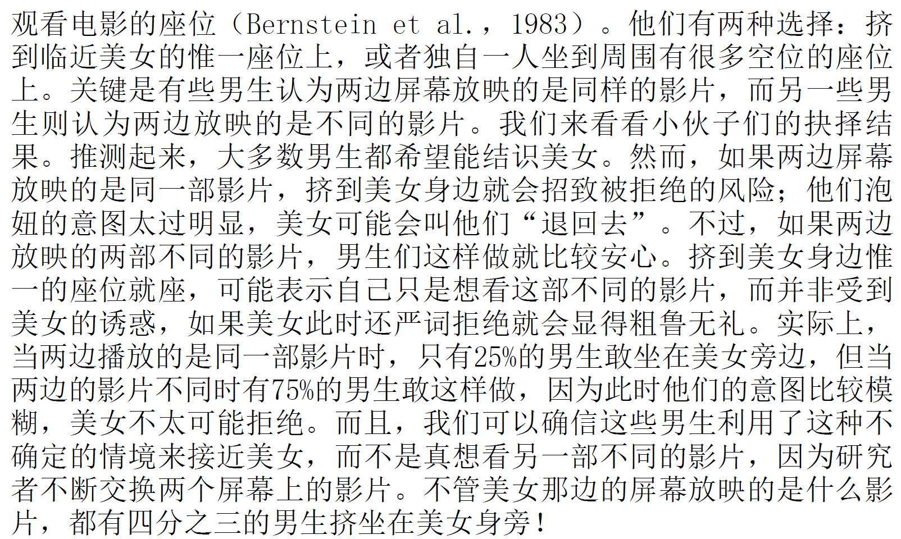
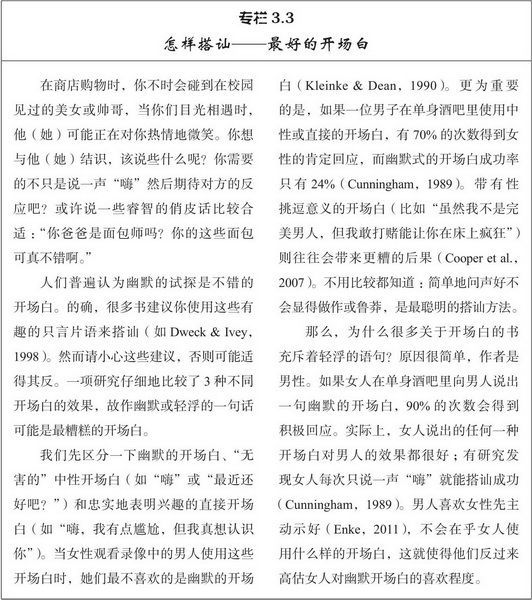
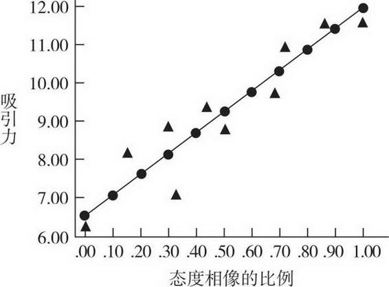
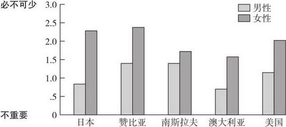

# 亲密关系
## 吸引力
> **吸引力的基础：一种奖赏**

- 人与人之间产生吸引力最基本的假设是：他人的出现对于我们有**奖赏**意义（Clore & Byrne，1974）
- 影响吸引力的 **奖赏(rewards)** 有两种类型：
  - **直接奖赏**:他人提供给我们的所有显而易见的愉悦,许多兴趣和赞许,我们就会对这种关注和接纳感到非常高兴。赏心悦目的个人特征
  - **间接利益**:物质利益如金钱或地位
- 多数情况下，人们提供的**直接奖赏**越多，对我们的吸引力就越强。
- 吸引力还受到很多不易觉察的因素影响:
  - 这些因素只与人们**外在的友善**、**俊美的长相**或**怡人的个性**有间接的关联
  - 例如，我们大多数人都喜欢自己，而新结识的人如果与我们有着某些**共同点**,他们都可能看上去更讨人喜欢
- 人们常常被那些能**为将来的后代提供生存优势**的人所吸引，即使他们根本还没想过养育孩子问题。
- 吸引力的确与我们认知到的他人具有吸引力的个人特征有关，但它还取决于我们自己的**需要、偏好、愿望以及所处的情境**（Graziano & Bruce，2008）。

> **临近：喜欢身边的人**

- 多数情况下，友谊和爱情都源自与身边人的交往。
  - 如果在教室里给大学生分派座位，大学生更可能**与坐在身边的人成为好友**，而不是那些坐在教室另一边的人，即便教室非常小（Back et al.，2008）。

> **方便：远亲不如近邻**
- 如果他人在我们身边，我们很容易得到他们提供的各种奖赏。

> **熟识：重复接触**

- **曝光效应**:。**重复地接触**他人（甚至只要看到他人照片）通常能增加我们对他们的喜欢程度(要善于制造机会)
  - 即使我们从来没有与陌生人说过话，我们仍倾向于**喜欢见过很多次的面孔**，而非不熟悉的面孔。
- 因为临近常常能导致熟识，而熟识又引起喜欢，所以与他人频繁的接触不仅能使交往更方便，而且会使对方看起来更有吸引力（Reiset al.，2001）。
- 我们往往更喜欢身边的人，然而如果他们令我们**厌烦**，那么临近只会**雪上加霜**。(别当舔狗)
  - 我们易被身边的人吸引，但如果我们与他们的接触**令人失望或者不快**，那还不如**保持距离**的君子之交呢。

> **长相吸引力：喜欢那些可爱的人**
> - 尽管我们都知道**人不可貌相**，但长相的确影响着我们。

- 一般来说，**且先不管对错**，我们*倾向*于认为外貌俊美的人**更讨人喜欢，更好相处**（Brewer & Archer，2007）。

> **对美丽的偏见：“美的就是好的”**

- 然而我们**并不会认为**长相好看的陌生人十全十美，外貌越有吸引力的人我们越容易认为他们较**放荡**（Brewer & Archer，2007）。
  - **理由是**我们倾向于认为俊美之人**大方得体、和蔼可亲**，因为被他们吸引，**期望**他们**反过来也喜欢我们**（Lemay et al.，2010）。**希望恒存**。
- 更惊人的发现是，新生儿也**偏好**成人认为漂亮的面孔（Slater et al.，2000）；婴儿还很小，不会受到社会规范影响，但**他们盯住漂亮面孔的时间远长于不漂亮的面孔。**(小孩哥的认可)
- 这些能吸引婴儿的面孔具有哪些特点呢？
  - 女人如果有“娃娃脸”的特征，比如**大眼睛、小鼻子、尖下巴和丰满的双唇**，就更有吸引力（Jones，1995）。有女人味，青春可人
  - 男性的吸引力则比较复杂。
    - 拥有**结实下颚和宽阔前额**的男性——看上去**坚强而有主宰力**——通常被人认为是帅哥（Rhodes，2006）。(外服)
    - 另一方面，如果通过电脑图像技术把普通男性的面孔变得**略微有点女性化和娃娃脸**，这种“**女性化了的**”男面孔——看上去**热情又友好**——也有吸引力。
- 更值得一提的是，女性喜欢哪种男人脸型取决于她们的**月经周期**：当处在**排卵前**的受孕期，她们会觉得**不修边幅、具有男子气特征**的面孔更吸引人，但**其他时间**则更喜欢**青春型、具有孩子气特征**的男性面孔（Little et al.，2002）。
- 漂亮面孔的轮廓大小是处在**平均水平**的,如果使用**电脑图像技术**制作**一张由不同人的面孔局部特征组合而成的新面孔图像**，得到的这种平均化的面孔几乎比组成它的所有单个面孔**更有吸引力**（Rubenstein et al.，2002）。
- 然而，这**并不表明**漂亮的人有着**平庸和普通的长相**。通过**平均化合成**的面孔在实际生活中是非常罕见的。合成面孔的局部特征相互之间**比例般配**：鼻子不会**过大**，眼睛不会**过小**，面孔的任何一部分都不会有过分的夸大、发育不良或者怪异。平均化的面孔也是**对称**的，面孔的两半是互为**镜像**的；**两只眼睛一般大小**，脸颊也是**一般宽**等等。**对称**的面孔本身就有吸引力，不论面孔是否是“平均化”了的
- **电脑合成的图像↓**
- 
- 最吸引人的**腰臀比例**（waist-to-hip ratio，WHR）的曲线比率0.7，即**腰部比臀部细30%**（见图3.3）；这种“沙漏”形状的身材对世界各地的男性都有**吸引力**（Singh，2004）
- **男性的吸引力稍显复杂**
  - 当腰部仅比臀部略窄，**腰臀比例**为**0.9**时，男性的身体最有吸引力。
  - 宽广的肩膀也有吸引力
  - 肩臀比例大（约为1.2）（Hughes & Gallup，2003）、肌肉强壮（Lassek& Gaulin，2009）
  - **然而，男性光有好身材并不能吸引女性，除非他还有其他资源**
  - 只有当他能**挣一份体面的薪水时**，他的腰臀比例**才会**影响女性对他的评价（Singh，1995）。男性**即使英俊但若贫穷**，对女性并不那么有吸引力。
- **长发**的女性比短发的女性对男性更有吸引力（Knapp-Kline etal.，2005）
- 未来伴侣身体**散发出的气味**对女性的影响比男性更大（Herz &Inzlicht，2002）。
- 女性还喜欢**聪明**的男性（这对于读到这本书的大多数男性都应该是好消息）。
> **长相吸引力的演化观**

- 人们对美貌的偏爱通常符合演化心理学的观点。
- 文化差异表现在方方面面，但世界各地的人**对于美丑的评判**仍**趋向一致**（Cunningham et al.，1995；Jones，1995）
- **婴儿**天生就**偏爱**那些同样能吸引成人的面孔（Slater etal.，2000）。对美丽长相的偏爱或许是**遗传**而来的。
- 面容英俊的男性比面容丑陋的男性的精子更**健康，更有活性**（Soler et al.，2003）。
- 有着**对称面孔**的人与面孔不对称的人相比，往往也拥有**对称的体型**，他们的身体和心理也更为**健康**，因而能找到更优秀的配偶（Perilloux et al.，2010）。
- **荷尔蒙**通过调节脂肪在人体的分布而影响腰臀比例。腰臀比例接近**0.7**（最吸引人的标准）的妇女，其体内带有特定比例的雌二醇和黄体酮（progesterone）混合激素，比缺少曲线美的妇女更容易受孕、身体也更健康（Jasienska et al.，2006）。
- **年轻**的妇女比年老的妇女更可能**留长发**，并且头发质量和**身体健康**有关。所以男人偏爱的长发与**女性配偶的健康**有关（Hinsz etal.，2001）。

> **美丽：交织着的代价与收益**

- 众所周知，美丽的女人比姿色平庸的女人的约会次数更多（Reis et al.，1980）。
  - 而且，与美女交往令男人如沐春风；他们交谈时滔滔不绝，忘我投入，觉得能与美女交往真是**三生有幸**。他们还会给可爱的女招待更多的小费（Lynn，2009）。
  - 英俊的男人也一样走运，他们能得到女人更多的微笑、交谈和积极情感（Ickes，2009）。
- 

> **礼尚往来：喜欢那些喜欢我们的人**

- 吸引力匹配现象表明，**要想享有成功的亲密关系**，我们应该追求最有可能**回报**我们的伴侣。
- 大多数人会用**下面的公式**来衡量**自己对他人的实际兴趣**，以及**接近伴侣和建立亲密关系的可能性**（Shanteau & Nagy，1979）：
  - **对未来伴侣的期望值=伴侣的外表吸引力×伴侣接纳自己的可能性**
- 。例如，绝代佳人对男人有非常高的标准要求；她们不单想要一个能成为好父亲的友善绅士，也不只需要经济实力雄厚的性感猛男，**她们希望伴侣拥有所有这些理想的条件**（Buss & Shackelford，2008）。('小仙女'也一样)
- **害羞之人**（ Wenzel &Emerson，2009）或**低自尊的人**（Cameron et al.，2010）往往紧张不安地估计他人会拒绝自己，因而**会追求不太出众的对象**。
- 当我们**不太确定**他人是否会接纳我们时，大多数人都**不愿意去冒被拒绝的风险**。
- 下面一项精巧的研究很好地说明了这一点，实验中大学男生必须选择
  - 意思大概是不敢表现出**明显意图**
-     
- 未必适用于国内

> **相似性：喜欢与我们相像的人**

- **遇上喜欢我们的人具有奖赏意义。**
- 如果能遇上和我们**恰好相像**的人，与我们有**同样的背景、兴趣和品位**，也令人感到愉悦快乐。
> **有吸引力的相像种类**
> 

- 首先就是在**年龄、性别、种族、教育程度、宗教信仰和社会地位**等人口统计学上的相像（Hitsch et al.，2010）。
- 其次是**态度和价值观**的相像。
  - 伴侣间**态度相同的程度**和**彼此的吸引力**有着简单直接的关联：**共同点越多，彼此越喜欢**（Byrne & Nelson，1965）
- 最后，伴侣们还可能有着**相似的性格**。
  - 比如，**两位爱好交际的人**或**两位害羞内向的人**首次相遇往往比内向和外向的人彼此相遇**更愉快**（Cuperman & Ickes，2009）。

> **匹配是广泛的过程**
> - 1994年，26岁的《花花公子》年度女郎安娜嫁给了89岁的亿万富翁马歇尔。

- 在这种情况下，伴侣们在很多方面**并不相像**，好像**相异反能相吸**。如果这样认为就太**幼稚**了，因为这样的伴侣实际上在**更广泛的意义上进行了匹配**，用长相换金钱，反之亦然。
  - 对一家网络交友机构的6 485名用户的调查发现，**长相丑陋**的男子（外貌吸引力最低的那10%的男士）每年需要多出**186 000**美元的**收入**，才能和**英俊的男子**（即外貌吸引力最高的那10%的男士）**一样吸引**到女性充分的注意力；如果这些丑陋的家伙真能挣那么多钱，女性对他们的关注就和长相英俊的男子一样多（Hitsch etal.，2010）。
- 如果我们**把匹配视为广泛的过程**，**不仅**涉及**长相吸引力**，而且包括**各种其他长处和特质**，那么很显然，人们总是会与**旗鼓相当的人**配成一对，同性相吸（相类似的人彼此吸引对方）就发生了。
- 这种公平交易是**演化心理学**的核心观点
  - 因为和健康、能生育的女人婚配更可能成功地繁衍下一代，**自然选择**大概促进了男性对年轻且漂亮的伴侣的兴趣（Buss，2012）。
  - 年轻之所以重要是因为女性到了中年绝经后就不能再生育了，**漂亮**之所以重要在于**它与健康的身体**有大致的**关联**（Thornhill & Gangestad，2006）。
  - 所以，男性特别看重女性的姣好容颜（见图3.5），并且随着男性年龄的增长，**与他们结婚的女性却比他们越来越年轻**（Dunn et al.，2010）：
  - **对经济情况的期望↓**
  - 
- 的确如图3.7 所示， 女性比男性更关心伴侣的经济状况（Gustavsson et al.，2008），挥金如土的男人比吝啬的男人能吸引更性感的伴侣（Kruger，2008）。而且，女性对伴侣年龄的偏爱**不会随着年龄增加而发生变化**；女人终其一生都喜欢嫁给**比自己略大几岁**的男人（Dunn et al.，2010）。
- **说到底匹配是一种广泛的过程，涉及各种资源和特质。**

> **障碍：得不到的就喜欢**

- 最后一个影响吸引力的因素是**人们努力克服障碍以实现期望的基本倾向**。
- 心理抗拒（reactance）理论认为，如果人们失去行动或者选择的自由，会奋力争取重获自由（Brehm & Brehm，1981）。因而，**如果我们面临失去某种事物的危险时，我们可能反而想得到更多。**

> **男女两性期望的理想伴侣**

- 前面我们曾谈到，男女两性对伴侣的长相吸引力和收入水平重要性的认识存在差别。然而，希望这些结果不会**误导**你，因为**尽管**存在这些差异，男人和女人对亲密伴侣**一般都有着同样的品质要求**（Li et al.，2011）。
- 在世界各地，人们评价未来的伴侣有三条基本标准（Tran etal.，2008）。如果可以选择，大多数人都期望伴侣有以下的**特点**：
   - 热情和忠诚，值得信赖、亲切友善、给予支持、善解人意；
   - 吸引力和活力，长相俊美、性感、外向；
   - 社会地位和资源，经济宽裕、生活安心。
- 所以，在评价未来的伴侣时，男人往往首先确保女友至少有**普通的长相**，然后再来寻找尽可能多的**热情、友善、诚实、坦率、稳定、幽默和智慧等等特征**（Li et al.，2002）。**绝世容貌**是男人所渴求的，但不如高水平的热情和忠诚重要（社会地位和经济资源屈居第三位）。
- **综上所述**，吸引力毕竟不是玄奥莫测的。男人专注于**长相**，女人专注于**资源**，但人人似乎都期望伴侣**友善、随和、可爱和亲切**，男人和女人在这方面**没什么差别**。
- 如果你是位不易动感情、大男子主义的男性，那么请注意了：如果在你的力量和权力之外表现出一些儿女柔情，女人会更为你陶醉。(O.o)

- 我的评价是,**要么有钱,要么有颜,不然滚边**