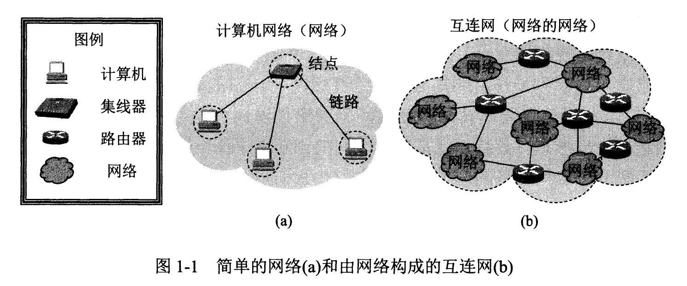
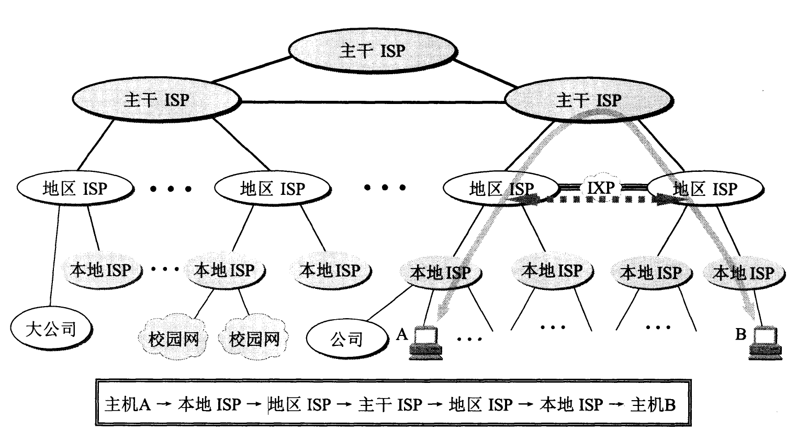
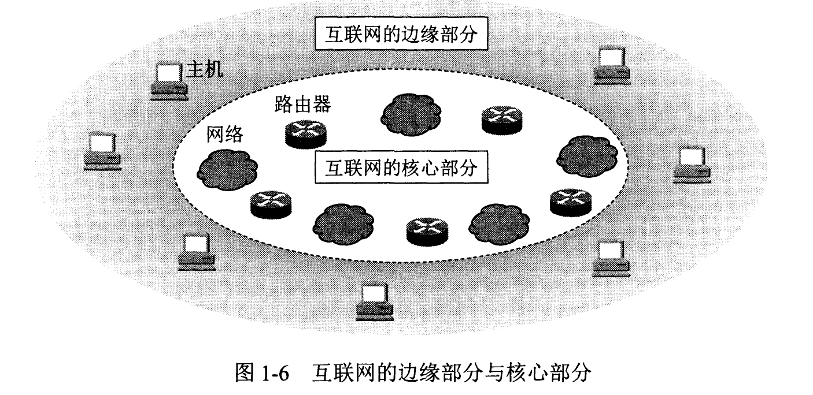
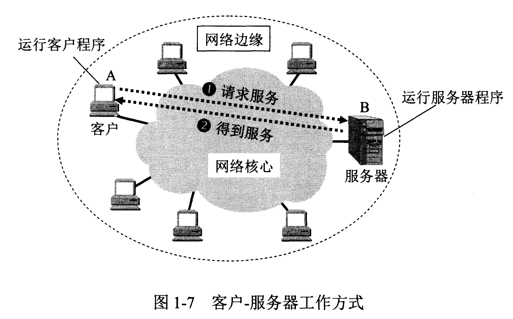
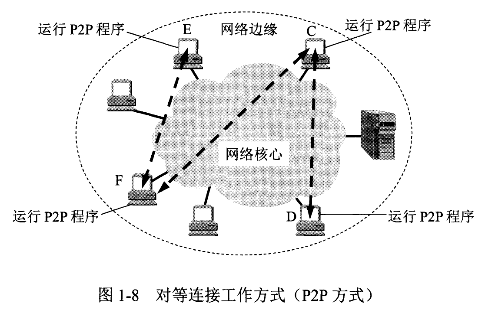
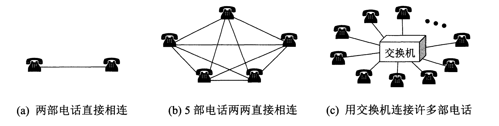

# 计算机网络
## 第一章 概述
### **计算机网络**
- 若干结点和链路构成,结点可以是计算机,路由器,交换机等
  - 
### **ISP**
- Internet Service Provider
  - 
  - **IXP**:
    - 主要作用就是允许两个网络直接相连并交换分组，而不需要再通过第三个网络来转发分组。
    - IXP的结构非常复杂。典型的IXP由一个或多个网络交换机组成，许多ISP再连接到这些网络交换机的相关端口上。IXP常采用工作在数据链路层的网络交换机,这些网络交换机都用局域网互连起来。
### **互联网组成**
  - 
  - **边缘部分**:由所有连接在互联网上的主机组成。这部分是用户直接使用的，用来进行通信（传送数据、音频或视频）和资源共享。这些主机称为**端系统**
    - 主机间通信:是主机内的程序(进程)与另一台程序(**进程**)通信,端口
    - 通信方式:
      - C/S:Client-Server,客户请求,服务器提供
        - 
      - P2P:Peer-to-Peer,既是服务端,也是客户.
        - 
  - **核心部分**:由大量网络和连接这些网络的**路由器**组成。这部分是为边缘部分提供服务的（提供连通性和交换）。 
    - 向网络边缘中的大量主机提供**连通性**，使边缘部分中的任何一台主机都能够向其他主机通信。
    - **路由器**:实现**分组交换**的关键构件,**任务**是转发收到的分组
      - **电路交换**:
        - **主要特点**:
          - 电话间的连接:当电话数量增多时,需要更多交换机
          - 